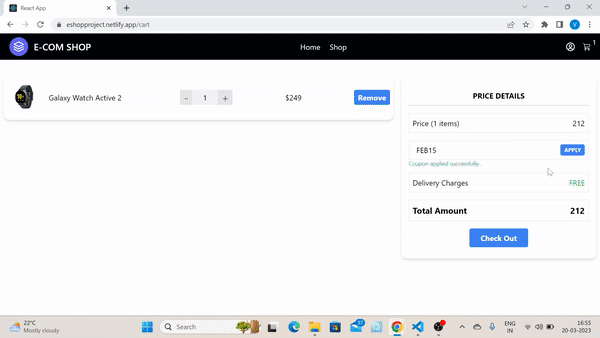
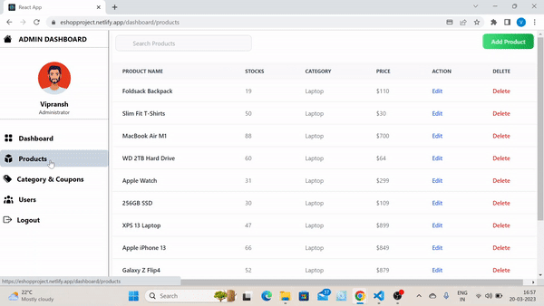

# E-Com Shop Application | React+Redux
Hi, I am **Vipransh Verma**, an aspiring **full stack JavaScript developer**.

It was a great experience in learning  state management in React.js application using Redux.

# Features

## 1. User Authentication
## 2. Secure Razorpay Payment
## 3. Check Order History
## 4. Category-wise Filter
## 5. Cart with local storage

# Project Images

[Live-Link](https://eshopproject.netlify.app/)
## Site Overview

## Payment Process

## Admin Dashboard
